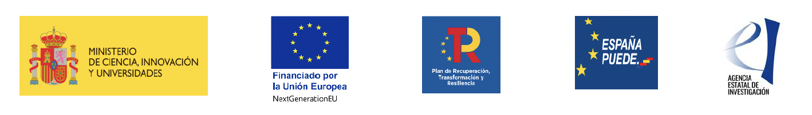

# Pie de página

Impulsado por la Universidad Carlos III de Madrid, ha recibido financiación    del Programa Estatal para Impulsar la Investigación Científico-Técnica y su Transferencia con la referencia EQC2021-007184-P y de la Comunidad de Madrid a través de sendos programas de investigación. 

