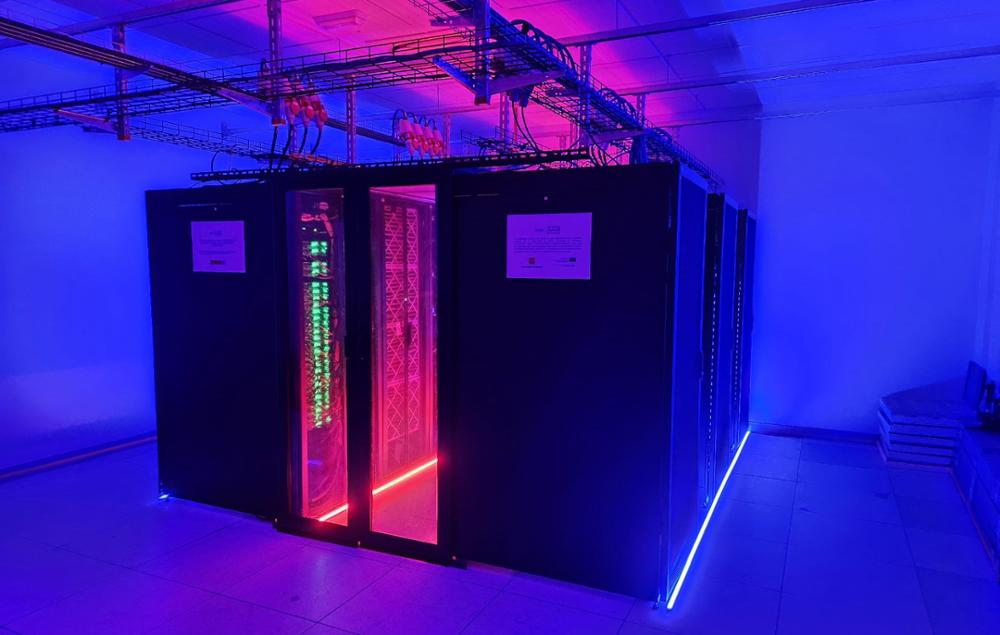

# Información general

El Centro de Computación Científica de la UC3M es un centro de servicios de computación y almacenamiento para grupos de I+D+i, OPIs y empresas relacionadas con la investigación y la innovación.

El C3 proporciona capacidad de cálculo, almacenamiento y soporte técnico a sus usuarios para promover y participar en la elaboración de proyectos de investigación y desarrollo tecnológico, así como para contribuir al desarrollo y fortalecimiento de la capacidad competitiva de sus usuarios.

Los computadores del C3 incluyen capacidad de cómputo y almacenamiento que exceden los recursos disponibles en sistemas habituales, siendo especialmente adecuados para las simulaciones numéricas, de biocomputación, y de inteligencia artificial, dado su volumen recursos, tanto en CPUs, como en CPUS y en capacidad de almacenamiento fiable.

